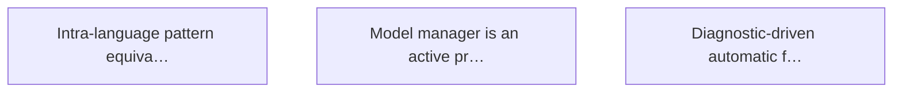

# Targets

## Active

### 🎯T2 Model manager is an active process
- **Weight**: 2 (value 13 / cost 8)
- **Estimated-cost**: 8
- **Acceptance**:
  - Model manager goroutine owns the forest, store, and symbol index
  - Watcher goroutine feeds file events to the model manager
  - On startup, manager reconciles filesystem state against stale SQLite database before accepting queries
  - MCP handlers send requests to the manager via channels — no direct access to forest or store
  - After apply writes files, the manager observes watcher events and re-parses automatically
  - Multiple concurrent MCP sessions on the same root are safe by construction
  - Test exists: two sessions do independent transforms and applies with consistent model
- **Context**: The current CodebaseModel is a passive struct with no concurrency control. The watcher produces events on a channel only drained by explicit Sync(). After apply, the model is stale. Multiple handlers sharing the model have unsynchronised access. The fix is making the model an active subsystem (actor pattern) that owns its state and serves queries through channels.
- **Tags**: daemon, concurrency, architecture
- **Status**: Identified
- **Discovered**: 2026-04-07

### 🎯T3 Diagnostic-driven automatic fixes
- **Weight**: 2 (value 13 / cost 8)
- **Estimated-cost**: 8
- **Acceptance**:
  - teach_fix tool associates a diagnostic regex pattern with a recipe and parameter extraction rules; stored in SQLite
  - auto_fix tool runs diagnostics, matches against the fix catalogue, applies safe fixes, reports uncertain ones
  - Fix loop re-runs diagnostics after each apply; terminates when clean, stuck, or iteration limit reached
  - Per-compiler normalisation handles at least Go, Rust, Python, and TypeScript diagnostic formats
  - Each fix entry has a confidence annotation (auto-apply vs. suggest)
- **Context**: The pieces exist — recipes (stored transforms), LSP diagnostics tool, pattern engine from T16. What's missing is the glue: diagnostic pattern → recipe binding, and the apply-recheck convergence loop. Closes the loop between compiler says something is wrong and sawmill fixes it automatically.
- **Tags**: diagnostics, automation
- **Status**: Identified
- **Discovered**: 2026-04-07

### 🎯T1 Intra-language pattern equivalences
- **Weight**: 1 (value 21 / cost 21)
- **Estimated-cost**: 21
- **Acceptance**:
  - teach_equivalence tool stores bidirectional pattern pairs
  - apply_equivalence rewrites matches in either direction
  - check_equivalences flags non-preferred forms as violations
  - Transitive chains produce derived equivalences
- **Context**: Originates from arr.ai work on cross-language transpilation as set relations. The intra-language case avoids type-bridge and grammar-extension problems. T16's pattern engine provides the foundation.
- **Tags**: research, pattern-matching
- **Status**: Identified
- **Discovered**: 2026-04-07

## Achieved

(none)

## Graph

