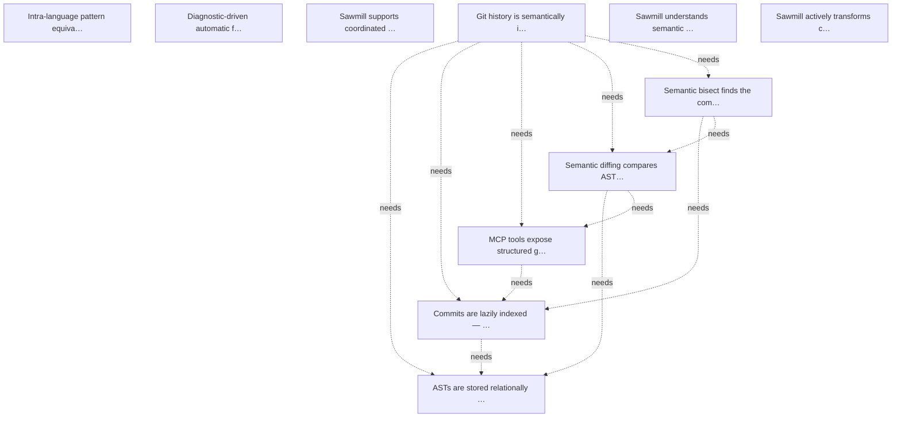

# Targets

## Active

### 🎯T1 Intra-language pattern equivalences
- **Value**: 21
- **Cost**: 21
- **Acceptance**:
  - teach_equivalence tool stores bidirectional pattern pairs
  - apply_equivalence rewrites matches in either direction
  - check_equivalences flags non-preferred forms as violations
  - Transitive chains produce derived equivalences
- **Context**: Originates from arr.ai work on cross-language transpilation as set relations. The intra-language case avoids type-bridge and grammar-extension problems. T16's pattern engine provides the foundation.
- **Tags**: research, pattern-matching
- **Status**: Identified
- **Discovered**: 2026-04-07

### 🎯T10 ASTs are stored relationally in SQLite — normalised node tables with integer FK node types, field names, and blob-SHA dedup across commits
- **Value**: 13
- **Cost**: 13
- **Acceptance**:
  - A nodes table stores (id, file_blob_sha, parent_id, node_type_id, field_name_id, start_byte, end_byte) with integer FKs to lookup tables
  - node_types and field_names lookup tables normalise repeated strings to integer IDs
  - Byte offsets use delta encoding from parent where beneficial
  - File content is stored once per unique blob SHA — if the same file appears across 500 commits unchanged, one copy exists
  - A commit_files junction table maps (commit_sha, file_path) → blob_sha
  - SQL can answer structural queries: function parameters, method receivers, return types, parent-child relationships
  - Indexing a commit parses only files whose blob SHA is not already indexed
- **Context**: This is the core data model for 🎯T6. The design was discussed in detail: normalised node types/field names as integer FKs, blob-SHA dedup to avoid re-parsing unchanged files, relational AST storage so SQL can answer structural queries directly without Tree-sitter round-trips. This replaces the current flat symbol-only index with a full structural representation.
- **Depends on**: 🎯T9
- **Tags**: git, schema, sqlite, T6
- **Origin**: decomposition of 🎯T6
- **Status**: Identified
- **Discovered**: 2026-04-11

### 🎯T11 Commits are lazily indexed — walking the commit graph and parsing files on demand, with progress tracking for bulk indexing
- **Value**: 8
- **Cost**: 8
- **Acceptance**:
  - HEAD, branch tips, and tags are indexed automatically when the daemon starts or a branch changes
  - Older commits are indexed lazily when a query touches them
  - Bulk indexing (index all commits) is available as an explicit MCP tool with progress reporting
  - First-parent walking is the default for linear history; merge commits fan out on demand
  - Already-indexed commits are skipped (commit SHA is the cache key)
- **Context**: Controls when and how commits get indexed. The key insight is that most queries only need recent history, so lazy indexing avoids upfront cost. Bulk indexing is available for users who want the full history. Depends on git object access (🎯T6.1) and the relational AST schema (🎯T6.2).
- **Depends on**: 🎯T9, 🎯T10
- **Tags**: git, indexing, daemon, T6
- **Origin**: decomposition of 🎯T6
- **Status**: Identified
- **Discovered**: 2026-04-11

### 🎯T12 MCP tools expose structured git queries — git_log, git_diff_summary, git_blame_symbol return structured data instead of text
- **Value**: 13
- **Cost**: 8
- **Acceptance**:
  - git_log returns structured commit metadata (SHA, author, date, message, files changed, symbols changed) with filtering and pagination
  - git_diff_summary returns added/removed/modified symbols per file between any two refs, not raw hunks
  - git_blame_symbol returns the commit that last modified a given symbol's body, signature, or existence separately
  - All tools accept refs (branch names, tags, SHAs) and resolve them via the git object layer
  - Results are compact structured data suitable for agent consumption without context window waste
- **Context**: The agent-facing surface of 🎯T6. These tools replace shelling out to git and parsing text output. They operate on the indexed data, so responses are fast. Depends on the indexing layer (🎯T6.3) being able to ensure queried commits are indexed.
- **Depends on**: 🎯T11
- **Tags**: git, mcp, tools, T6
- **Origin**: decomposition of 🎯T6
- **Status**: Identified
- **Discovered**: 2026-04-11

### 🎯T13 Semantic diffing compares ASTs structurally — detecting moves, renames, parameter changes, and generating API surface changelogs
- **Value**: 13
- **Cost**: 13
- **Acceptance**:
  - Structural diff between two commits produces edit operations: add, remove, modify, move, rename
  - Move detection: a function deleted from file A and added to file B with similar AST structure is reported as a move
  - Rename detection: a symbol with changed name but preserved structure is reported as a rename
  - Signature change detection: parameter list or return type changes are reported specifically
  - API surface changelog between two tags lists added/removed/changed public symbols with their signature changes
  - Data format diffs (YAML, JSON, TOML, XML) report key-level changes, not line-level
- **Context**: The high-value capability that makes semantic git qualitatively different from text-based git. Uses the relational AST data to compare structure rather than text. GumTree-style algorithm (top-down isomorphic subtree matching, bottom-up container matching) is the likely approach. Data format diffs are trivially enabled since Tree-sitter already parses them. Depends on the relational AST schema (🎯T6.2) and query tools (🎯T6.4).
- **Depends on**: 🎯T10, 🎯T12
- **Tags**: git, diffing, semantic, T6
- **Origin**: decomposition of 🎯T6
- **Status**: Identified
- **Discovered**: 2026-04-11

### 🎯T14 Semantic bisect finds the commit where a structural predicate changed — without running the code
- **Value**: 8
- **Cost**: 5
- **Acceptance**:
  - git_semantic_bisect accepts a structural predicate (e.g. 'function X has parameter Y', 'type T implements interface I') and a commit range
  - Binary search over the commit range, indexing commits as needed, to find the first commit where the predicate flips
  - Returns the commit SHA, author, message, and the specific structural change that caused the predicate to flip
- **Context**: A natural combination of lazy indexing and structural queries. Instead of 'does this commit build?' (requiring code execution), it answers 'at which commit did this structural property change?' (requiring only parsing). Depends on the indexing layer and structural query capability.
- **Depends on**: 🎯T11, 🎯T13
- **Tags**: git, bisect, semantic, T6
- **Origin**: decomposition of 🎯T6
- **Status**: Identified
- **Discovered**: 2026-04-11

### 🎯T3 Diagnostic-driven automatic fixes
- **Value**: 13
- **Cost**: 13
- **Acceptance**:
  - teach_fix tool associates a diagnostic pattern with a fix action (inline transform or recipe reference) with parameter extraction from regex captures; stored in SQLite
  - auto_fix tool runs diagnostics, matches against catalogue, applies safe fixes, reports uncertain ones; convergence loop terminates when clean, stuck, or iteration limit reached
  - Pre-populated catalogue covers common Go and TypeScript errors out of the box
  - Observation-based learning: when auto_fix reports unmatched diagnostics and a subsequent operation resolves them, sawmill offers to save the pairing
  - Per-compiler diagnostic normalisation for at least Go and TypeScript
  - Each fix entry has a confidence annotation (auto-apply vs. suggest)
  - Cycle detection: if a diagnostic reappears after its fix was applied, skip it and flag the fix as broken
- **Context**: Two bootstrapping paths: pre-populated entries from compiler error catalogues for common cases, and learn-from-observation for project-specific patterns. The agent already fixes errors manually — sawmill just needs to watch and remember.
- **Tags**: diagnostics, automation
- **Status**: Identified
- **Discovered**: 2026-04-07

### 🎯T5 Sawmill supports coordinated transforms across multiple repositories
- **Value**: 8
- **Cost**: 13
- **Acceptance**:
  - Transforms can target multiple project roots in a single operation
  - Daemon manages models for multiple repos concurrently (already partially true)
  - Cross-repo batch operations produce per-repo diffs/previews
  - PR lifecycle support: create branches and PRs across target repos
- **Context**: Sawmill's architecture (global daemon, per-project models, MCP interface) is naturally extensible to multi-repo workflows. This would cover the same ground as Sourcegraph Batch Changes but with native AST-level transformation intelligence built in, rather than BYO container scripts. The daemon already manages multiple project roots — the gap is orchestration: repo discovery, coordinated cross-repo transforms, and PR lifecycle management.
- **Tags**: multi-repo, orchestration, feature
- **Origin**: Discussion comparing sawmill to Sourcegraph — identified cross-repo as a natural extension
- **Status**: Identified
- **Discovered**: 2026-04-10

### 🎯T6 Git history is semantically indexed — commits are parsed with Tree-sitter and symbol changes are queryable via MCP tools
- **Value**: 20
- **Cost**: 20
- **Acceptance**:
  - Commits are lazily parsed with Tree-sitter and symbol tables stored in SQLite keyed by commit SHA
  - Blob-SHA deduplication avoids re-parsing unchanged files across commits
  - MCP tools provide structured git queries: git_log (structured metadata), git_blame_symbol (who last touched a symbol), git_diff_summary (added/removed/modified symbols per file)
  - Semantic bisect finds the commit where a structural predicate changed (e.g. function gained a parameter)
  - Semantic blame distinguishes when a symbol was introduced, when its body was last modified, and when its signature last changed
  - Refactoring detection recognises renames and moves across files by comparing AST structure minus identifiers
  - API surface changelog can be auto-generated from semantic diffs between tags
- **Context**: Agents constantly shell out to git log, git diff, git blame and parse text output, wasting context window and losing structural information. Sawmill already has Tree-sitter parsing and a SQLite symbol index for the working tree — extending this across git history creates a 'semantic git' layer where queries operate on structure (functions, types, parameters) rather than text (lines, hunks). The daemon architecture means the index persists and only grows with new commits. Git history is immutable, so once indexed, it's indexed forever. This is the foundation layer that enables cross-version queries, semantic diffing, convention drift detection, and dead code archaeology.
- **Depends on**: 🎯T9, 🎯T10, 🎯T11, 🎯T12, 🎯T13, 🎯T14
- **Tags**: git, indexing, semantic, foundation
- **Origin**: design discussion — git indexing in sawmill
- **Status**: Identified
- **Discovered**: 2026-04-10

### 🎯T7 Sawmill understands semantic identity across representations — the same value in code, config, schema, and embedded DSLs is recognised as one entity
- **Value**: 13
- **Cost**: 20
- **Acceptance**:
  - Sawmill can parse embedded DSLs within string literals (SQL in Go, regex in Python, GraphQL in TS tagged templates) using Tree-sitter injection grammars
  - Cross-file semantic identity: a timeout value in Go code, the same key in YAML config, and a DEFAULT in a SQL migration are linked as the same entity
  - Git history detects cross-representation migrations: literal deleted from code + key added to config = migration, not unrelated changes
  - Convention drift detection: track when extracted values regress to hardcoded literals
  - Interface-implementation tracking: detect when a proto/OpenAPI schema adds a field but the Go implementation doesn't use it yet
- **Context**: Real codebases express the same semantic content in multiple formats: Go structs mirror protobuf schemas, config YAML duplicates code defaults, SQL migrations encode the same constraints as validation logic. Today these connections are invisible to tools — git sees unrelated text changes across files. Inspired by the Real language design discussion about 'the end of all strings' — every structured value is the same entity regardless of its syntactic representation. Sawmill's multi-language Tree-sitter parsing and SQLite store are uniquely positioned to track these cross-representation relationships. Builds on git semantic indexing to detect migrations and drift over time.
- **Tags**: cross-representation, semantic, embedded-dsl, detection
- **Origin**: design discussion — cross-representation awareness, inspired by Real macro invocation architecture
- **Status**: Identified
- **Discovered**: 2026-04-10

### 🎯T8 Sawmill actively transforms content between representations — extract literals to config, inline config to code, extract embedded DSLs to files, sync schemas with implementations
- **Value**: 13
- **Cost**: 20
- **Acceptance**:
  - extract_to_config: select code literals, generate YAML/JSON config with sensible keys, rewrite code to read from config, generate loader boilerplate
  - extract_to_env: generate .env.example, rewrite code to use os.Getenv/process.env, update .gitignore
  - extract_dsl: move SQL string literals to .sql files with go:embed, regex to compiled patterns, GraphQL to .graphql files
  - promote_constant: magic numbers become named constants, config entries, or enum members depending on semantic context
  - align_representations: given a protobuf schema and Go struct, generate missing fields in either direction; sync JSON Schema with TypeScript interfaces
  - internalise_dependency: inline config values used only once, collapse single-use .sql files back to code
  - migrate_pattern: structurally identify all instances of an old pattern and rewrite to a new one with proper import management
  - All transforms produce diff previews and support undo, consistent with existing sawmill transform workflow
- **Context**: Sawmill currently transforms code within a single language. The natural extension is cross-file, cross-format transforms: extract structured content from one representation, create it in another, and rewrite the original to reference the extraction. This is a generic pattern — extract_to(source_pattern, target_format, reference_style) — of which specific transforms like extract_to_config and extract_dsl are instances. Combined with git semantic indexing, the system creates a feedback loop: transforms perform migrations, git indexing verifies they stuck, and the convention system flags regressions. Also enables git workflow automation: post-squash-merge cleanup, semantic bisect on structural predicates, branch hygiene with semantic merge detection.
- **Tags**: cross-representation, transform, extraction, git-workflow
- **Origin**: design discussion — cross-representation transforms and git workflow automation
- **Status**: Identified
- **Discovered**: 2026-04-10

## Achieved

### 🎯T9 Git objects are accessible from Go — sawmill can read commits, trees, and blobs from the git repo without shelling out
- **Value**: 8
- **Cost**: 5
- **Acceptance**:
  - A git package provides Go functions to walk commits, read trees, and extract blob contents by SHA
  - No dependency on the git CLI — uses go-git or direct packfile reading
  - Blob content is accessible as []byte for feeding to Tree-sitter
  - Commit metadata (author, date, message, parent SHAs) is available as structured data
- **Context**: Everything in 🎯T6 depends on being able to read git objects programmatically. This is the lowest-level foundation — without it, nothing else can be built. Pure Go is preferred (go-git or similar) to maintain the no-CGo property.
- **Tags**: git, foundation, T6
- **Origin**: decomposition of 🎯T6
- **Status**: Achieved
- **Discovered**: 2026-04-11
- **Achieved**: 2026-04-11

### 🎯T4 CST node tree is stored in SQLite — in-memory CSTs are transient parse artifacts only
- **Value**: 13
- **Cost**: 20
- **Acceptance**:
  - Nodes table stores full tree structure (type, field, parent, byte ranges) for all parsed files
  - All structural queries (find_references, query, pattern matching) run against SQLite, not in-memory CSTs
  - In-memory CSTs exist only during parse of a single file, then are discarded
  - Daemon memory stays bounded regardless of project size — scales with SQLite page cache, not file count
  - Cold start is instant — no full-project reparse needed, nodes persist across restarts
- **Context**: Tree-sitter CSTs (10-100x source size) were held in memory for every file indefinitely, causing the daemon to consume multiple GB on large projects. The fix is to serialize the full node tree into SQLite after parsing, then discard the in-memory CST. Structural queries become SQL joins against the nodes table — which is actually more powerful than S-expression queries (cross-file joins, aggregation, set operations). Tree-sitter is still used for parsing, but SQLite becomes the query engine.
- **Tags**: performance, daemon, memory
- **Origin**: User report — daemon killed due to memory pressure
- **Status**: Achieved
- **Discovered**: 2026-04-09
- **Achieved**: 2026-04-10

### 🎯T2 Model manager is an active process
- **Value**: 13
- **Cost**: 8
- **Acceptance**:
  - Model manager goroutine owns the forest, store, and symbol index
  - Watcher goroutine feeds file events to the model manager
  - On startup, manager reconciles filesystem state against stale SQLite database before accepting queries
  - MCP handlers send requests to the manager via channels — no direct access to forest or store
  - After apply writes files, the manager observes watcher events and re-parses automatically
  - Multiple concurrent MCP sessions on the same root are safe by construction
  - Test exists: two sessions do independent transforms and applies with consistent model
- **Context**: The current CodebaseModel is a passive struct with no concurrency control. The watcher produces events on a channel only drained by explicit Sync(). After apply, the model is stale. Multiple handlers sharing the model have unsynchronised access. The fix is making the model an active subsystem (actor pattern) that owns its state and serves queries through channels.
- **Tags**: daemon, concurrency, architecture
- **Status**: Achieved
- **Discovered**: 2026-04-07
- **Achieved**: 2026-04-08

## Graph

